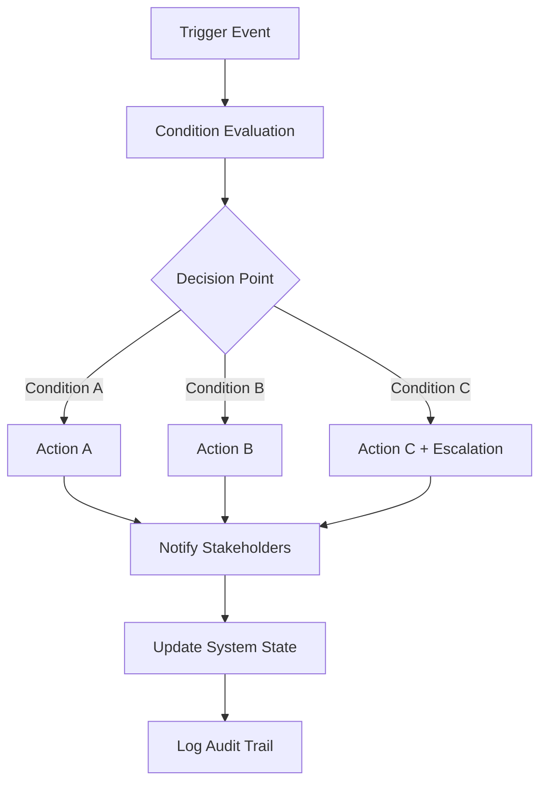
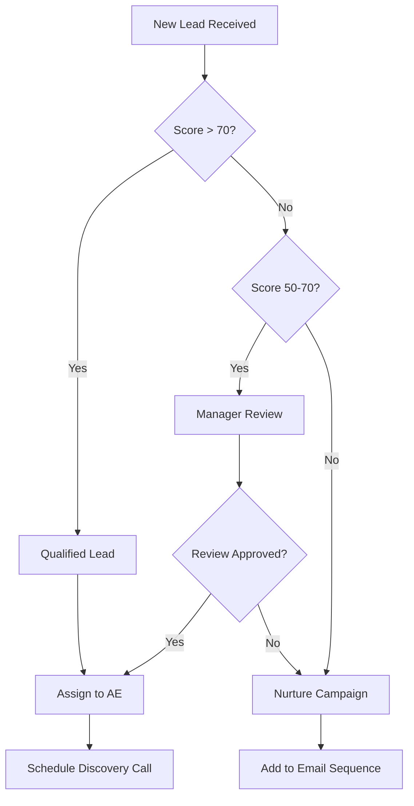
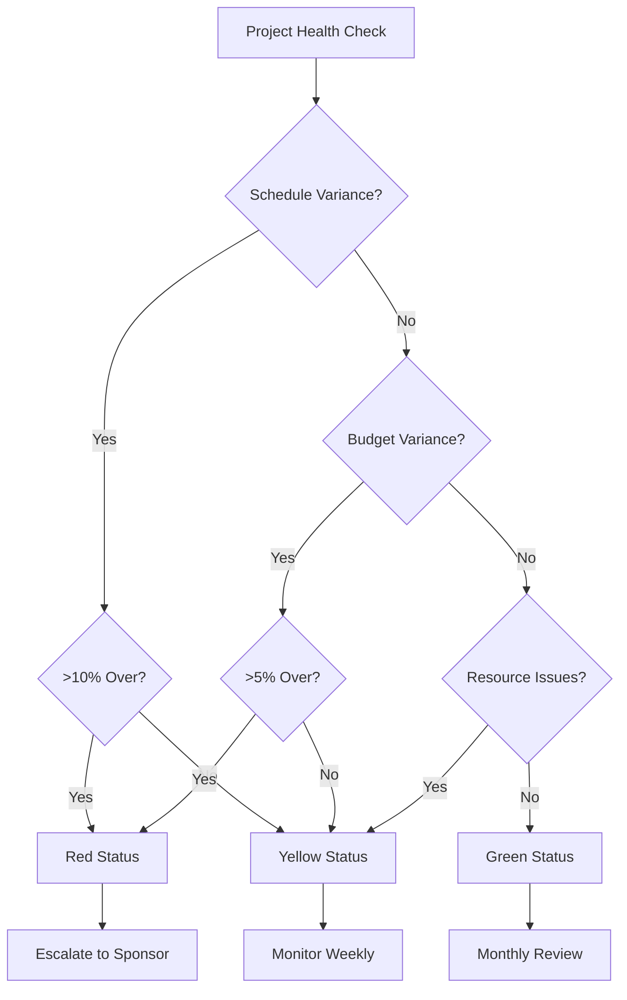
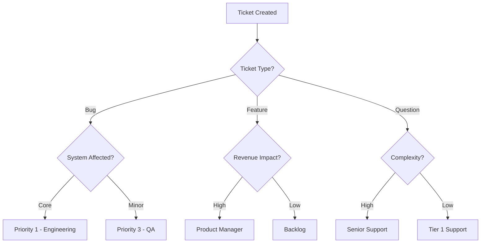
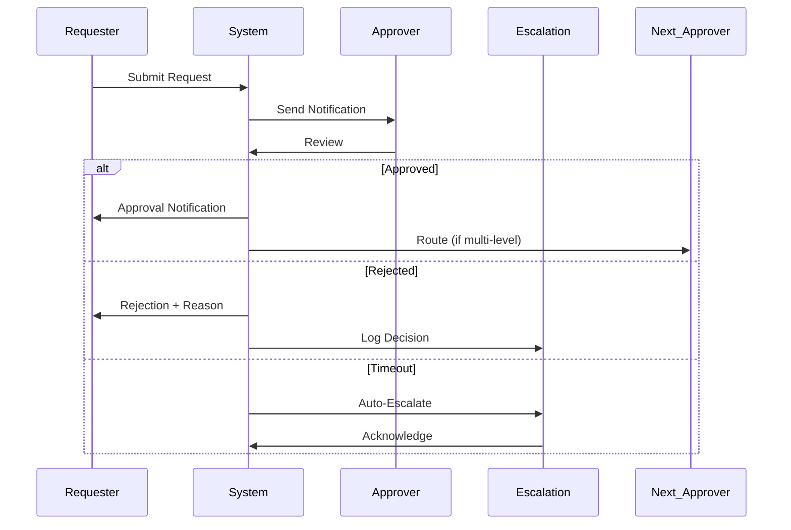

# Automation Logic SOP

## Document Information
- **SOP ID**: AUTO-001
- **Version**: 1.0.0
- **Effective Date**: 2024-01-01
- **Owner**: Automation Engineer Lead
- **Last Review**: 2024-01-01

## Purpose
Define automated decision trees, workflow triggers, approval chains, escalation logic, and performance metrics automation for Life OS operations.

## Scope
This SOP covers all automation logic including business rules, workflow automation, AI-assisted decisions, and system integrations.

## Process Overview



## Detailed Procedures

### 1. Decision Trees

#### 1.1 Lead Qualification Decision Tree


#### 1.2 Project Risk Decision Tree


#### 1.3 Support Ticket Routing


### 2. Automated Workflow Triggers

#### 2.1 Trigger Configuration
```json
{
  "workflow_triggers": {
    "sales_pipeline": {
      "triggers": [
        {
          "event": "lead_converted",
          "conditions": ["source == 'web'", "score > 70"],
          "actions": ["create_opportunity", "notify_ae", "schedule_followup"]
        },
        {
          "event": "deal_stage_changed",
          "conditions": ["stage == 'negotiation'", "value > 50000"],
          "actions": ["notify_legal", "request_approval", "create_contract"]
        },
        {
          "event": "deal_won",
          "conditions": ["all"],
          "actions": ["create_onboarding_project", "notify_success_team", "update_forecast"]
        }
      ]
    },
    "client_onboarding": {
      "triggers": [
        {
          "event": "onboarding_started",
          "conditions": ["all"],
          "actions": ["send_welcome_email", "schedule_kickoff", "create_workspace"]
        },
        {
          "event": "training_completed",
          "conditions": ["all users == true"],
          "actions": ["update_progress", "schedule_go_live", "notify_stakeholders"]
        }
      ]
    },
    "support": {
      "triggers": [
        {
          "event": "ticket_created",
          "conditions": ["severity == 'critical'"],
          "actions": ["page_on_call", "notify_manager", "create_bridge_channel"]
        }
      ]
    }
  }
}
```

#### 2.2 Trigger Syntax
```yaml
trigger_definition:
  name: "descriptive_name"
  event: "system_event"
  conditions:
    - field: "variable"
      operator: "eq|gt|lt|contains|in"
      value: "value_or_list"
      
  actions:
    - action_type: "notification|api_call|update|workflow"
      target: "destination"
      payload: "data_template"
      
  timing:
    evaluation: "immediate|scheduled"
    retry_policy:
      attempts: 3
      delay: 300
      backoff: "exponential"
```

### 3. Approval Chains Automation

#### 3.1 Approval Workflow Configuration
```json
{
  "approval_workflows": {
    "expense_approval": {
      "threshold_approvers": {
        "0_500": ["direct_manager"],
        "500_2000": ["manager", "finance"],
        "2000_10000": ["manager", "finance_director"],
        "10000_50000": ["manager", "finance_director", "cfo"],
        "50000_plus": ["manager", "finance_director", "cfo", "ceo"]
      },
      "escalation": {
        "timeout_hours": 48,
        "escalate_to": "manager_of_approver",
        "reminder_hours": [24, 36]
      }
    },
    "content_approval": {
      "blog_posts": ["content_lead"],
      "press_releases": ["pr_manager", "legal"],
      "marketing_materials": ["marketing_director", "brand"]
    },
    "project_approval": {
      "initiation": ["sponsor", "pm_coordinator"],
      "budget_change": ["finance", "sponsor"],
      "scope_change": ["pm_lead", "stakeholders"]
    }
  }
}
```

#### 3.2 Approval Action Flow


### 4. Escalation Logic

#### 4.1 Escalation Matrix
```json
{
  "escalation_matrix": {
    "sales": {
      "deal_value": {
        "escalation_point": 100000,
        "approver": "vp_sales",
        "timeline": "24 hours"
      },
      "deal_stuck": {
        "escalation_point": "30 days in same stage",
        "approver": "sales_manager",
        "timeline": "48 hours"
      }
    },
    "support": {
      "ticket_age": {
        "p1": "1 hour",
        "p2": "4 hours",
        "p3": "24 hours",
        "p4": "72 hours"
      },
      "sla_breach": {
        "first_breach": "notify_team_lead",
        "second_breach": "notify_director",
        "third_breach": "notify_vp"
      }
    },
    "project": {
      "schedule": {
        "variance": "10%",
        "escalate_to": "steering_committee",
        "action": "impact_assessment"
      },
      "budget": {
        "variance": "5%",
        "escalate_to": "project_sponsor",
        "action": "reforecast"
      }
    }
  }
}
```

#### 4.2 Escalation Rules Engine
```yaml
escalation_rules:
  condition_based:
    - rule: "ticket_priority == P1 AND age_hours > 1"
      action: "page_engineer_on_call"
      
    - rule: "deal_value > 100000 AND days_in_negotiation > 14"
      action: "notify_vp_sales"
      
    - rule: "project_budget_variance > 10_percent"
      action: "schedule_emergency_review"
      
  time_based:
    - rule: "no_update_for_days > 7"
      action: "send_reminder"
      
    - rule: "approval_pending_for_days > 3"
      action: "escalate_to_backup"
      
  event_based:
    - rule: "sla_breach_occurred"
      action: "create_incident_report"
      
    - rule: "quality_metric_dropped"
      action: "trigger_quality_review"
```

### 5. Performance Metrics Automation

#### 5.1 Metrics Collection Configuration
```json
{
  "metrics_automation": {
    "collection": {
      "sales": {
        "pipeline_velocity": {"frequency": "daily", "source": "crm"},
        "win_rate": {"frequency": "weekly", "source": "crm"},
        "avg_deal_size": {"frequency": "weekly", "source": "crm"},
        "sales_cycle": {"frequency": "weekly", "source": "crm"}
      },
      "operations": {
        "uptime": {"frequency": "continuous", "source": "monitoring"},
        "response_time": {"frequency": "hourly", "source": "logging"},
        "error_rate": {"frequency": "continuous", "source": "monitoring"}
      },
      "financial": {
        "revenue": {"frequency": "daily", "source": "accounting"},
        "expenses": {"frequency": "daily", "source": "accounting"},
        "cash_flow": {"frequency": "weekly", "source": "accounting"}
      }
    },
    "calculation": {
      "kpis": [
        {"name": "mrr_growth", "formula": "(current_mrr - prev_mrr) / prev_mrr"},
        {"name": "customer_churn", "formula": "churned_customers / total_customers"},
        {"name": "net_revenue_retention", "formula": "(expansion + base) / base"}
      ]
    }
  }
}
```

#### 5.2 Dashboard Automation
```yaml
dashboard_automation:
  frequency:
    real_time: ["System health", "Active users"]
    hourly: ["API calls", "Error rates"]
    daily: ["Sales metrics", "Ticket volumes"]
    weekly: ["Performance trends", "Capacity planning"]
    monthly: ["Executive summary", "Strategic KPIs"]
    
  distribution:
    automated:
      - daily_report: "7:00 AM"
      - weekly_summary: "Monday 9:00 AM"
      - monthly_report: "1st business day"
      
  alerts:
    threshold_based:
      - metric: "error_rate"
        condition: "> 1%"
        action: "alert_on_call"
        
      - metric: "response_time"
        condition: "> 500ms"
        action: "alert_engineering"
        
      - metric: "deal_pipeline"
        condition: "< forecast * 0.9"
        action: "notify_sales_manager"
```

### 6. Business Rules Engine

#### 6.1 Rule Definition Framework
```json
{
  "business_rules": {
    "rule_template": {
      "name": "string",
      "description": "string",
      "condition": "expression",
      "actions": ["array"],
      "priority": "number",
      "enabled": "boolean",
      "audit_log": "boolean"
    },
    "sample_rules": [
      {
        "name": "auto_assign_lead",
        "condition": "lead.source == 'web' AND lead.score > 60",
        "actions": ["assign_to_territory('web')", "notify_assignee()"],
        "priority": 1,
        "enabled": true
      },
      {
        "name": "escalate_overdue_invoice",
        "condition": "invoice.age_days > 30 AND invoice.status == 'overdue'",
        "actions": ["send_demand_notice()", "notify_credit_manager()"],
        "priority": 2,
        "enabled": true
      }
    ]
  }
}
```

#### 6.2 Rule Evaluation Engine
```python
class RuleEngine:
    def __init__(self, rules):
        self.rules = sorted(rules, key=lambda r: r.priority)
    
    def evaluate(self, context):
        triggered = []
        for rule in self.rules:
            if rule.enabled and self._evaluate_condition(rule, context):
                self._execute_actions(rule, context)
                triggered.append(rule)
                if rule.terminal:
                    break
        return triggered
    
    def _evaluate_condition(self, rule, context):
        # Parse and evaluate rule condition expression
        # Returns True if condition is met
        pass
    
    def _execute_actions(self, rule, context):
        for action in rule.actions:
            # Execute defined action
            # Log to audit trail
            pass
```

## Automation Scripts Reference

| Script | Purpose | Location |
|--------|---------|----------|
| `generate_sop.sh` | Create SOPs from templates | `tools/sop-automation/` |
| `track_execution.py` | Track SOP compliance | `tools/sop-automation/` |
| `compliance_check.py` | Verify SOP adherence | `tools/sop-automation/` |
| `version_control.sh` | Manage SOP versions | `tools/sop-automation/` |
| `team_assign.py` | Auto-assign tasks | `tools/sop-automation/` |
| `decision_engine.py` | Execute decision trees | `tools/sop-automation/` |
| `metrics_collector.py` | Gather performance data | `tools/sop-automation/` |

## Integration Points

| System | Integration Type | Data Flow |
|--------|-----------------|-----------|
| CRM | API | Bi-directional |
| Project Management | Webhook | Inbound |
| Accounting | File/API | Inbound |
| Communication | API | Outbound |
| Monitoring | Webhook | Inbound |
| ITSM | API | Bi-directional |

## Testing & Validation

#### 7.1 Automation Testing Strategy
```yaml
automation_testing:
  unit_tests:
    - "Rule conditions evaluate correctly"
    - "Actions execute properly"
    - "Error handling works"
    
  integration_tests:
    - "Trigger events fire correctly"
    - "System state updates properly"
    - "Notifications send correctly"
    
  regression_tests:
    - "New rules don't break existing"
    - "Performance is maintained"
    - "Audit logs are complete"
```

## Governance

### 8.1 Change Management
- [ ] All rule changes require documented approval
- [ ] Testing required before production deployment
- [ ] Rollback plan for each automation change
- [ ] Monitoring in place for 24 hours post-deployment

### 8.2 Monitoring & Alerting
- [ ] Automation execution monitored
- [ ] SLA breaches alert to owners
- [ ] Error rates tracked and reviewed
- [ ] Performance metrics dashboard maintained

## Metrics & KPIs

| Metric | Target | Measurement Frequency |
|--------|--------|----------------------|
| Automation Coverage | >80% | Quarterly |
| Rule Accuracy | >99% | Monthly |
| Execution Time | <100ms | Per execution |
| Error Rate | <0.1% | Weekly |
| Compliance Rate | 100% | Monthly |

---

*Document Version: 1.0.0*
*Last Updated: 2024-01-01*
*Next Review: 2024-04-01*
