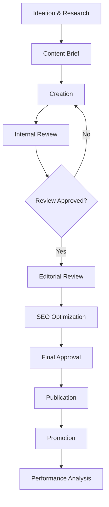
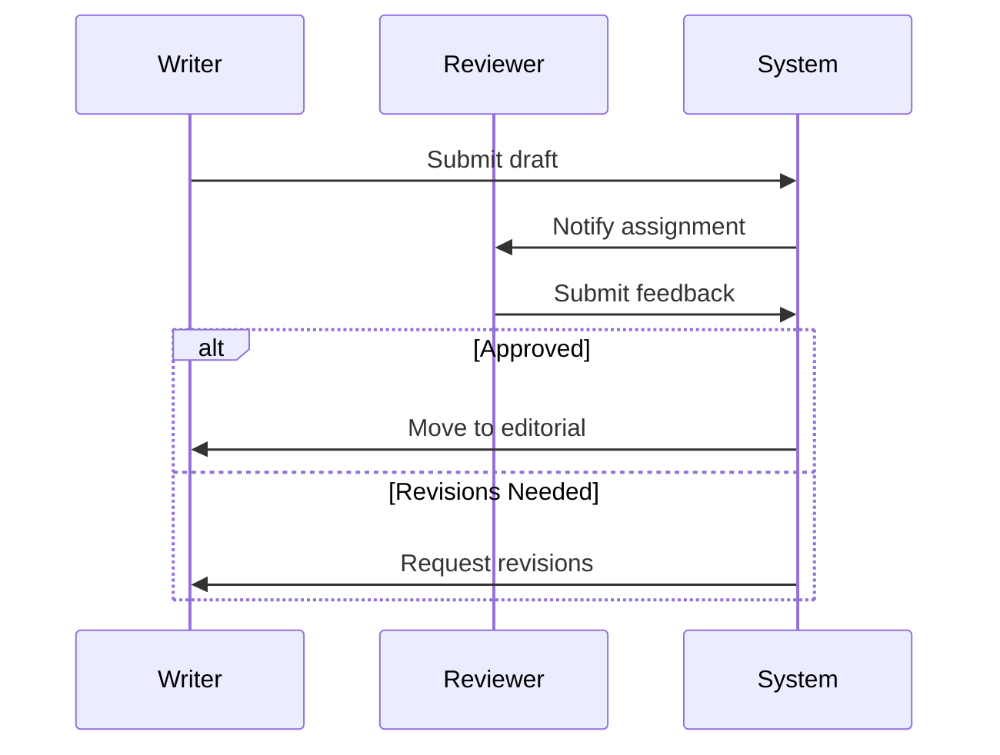

# Content Workflow SOP

## Document Information
- **SOP ID**: CON-001
- **Version**: 1.0.0
- **Effective Date**: 2024-01-01
- **Owner**: Content Team Lead
- **Last Review**: 2024-01-01

## Purpose
Establish a consistent, efficient, and quality-driven content creation process from ideation through publication and performance analysis.

## Scope
This SOP covers all content types including blog posts, social media, email marketing, whitepapers, case studies, videos, and podcasts.

## Process Overview



## Detailed Procedures

### 1. Ideation & Research

#### 1.1 Content Ideation Sources
| Source | Description | Frequency |
|--------|-------------|-----------|
| Keyword Research | SEO-driven topic discovery | Weekly |
| Competitor Analysis | Gap analysis of competitor content | Monthly |
| Customer Questions | Support tickets, sales feedback | Weekly |
| Industry Trends | News, reports, social signals | Daily |
| Performance Data | Top-performing content topics | Monthly |

#### 1.2 Content Calendar Management
```json
{
  "content_calendar": {
    "monthly_targets": {
      "blog_posts": 12,
      "social_posts": 60,
      "email_newsletters": 4,
      "whitepapers": 1,
      "case_studies": 2,
      "videos": 4,
      "podcasts": 4
    },
    "planning_horizon": "3_months",
    "review_frequency": "weekly",
    "approval_workflow": ["content_lead", "marketing_director"]
  }
}
```

#### 1.3 Ideation Output
```yaml
ideation_document:
  date: "YYYY-MM-DD"
  contributors: ["name1", "name2"]
  
  topics:
    - topic: "Subject Area"
      format: "Blog/Social/Video"
      keyword_target: "Primary keyword"
      status: "research_needed/in_progress/approved"
      
  research_notes:
    - source: "URL or document"
      key_insight: "Summary"
      citation: "Reference"
```

### 2. Content Brief

#### 2.1 Brief Template
```markdown
## Content Brief: [Title]

### Meta Information
- **Format**: [Blog/Social/Video/Etc.]
- **Target Audience**: [Persona]
- **Word Count/Length**: [Target]
- **Due Date**: [Date]
- **Assignee**: [Writer/Creator]
- **Reviewer**: [Editor]

### Content Requirements
- **Primary Keyword**: [SEO target]
- **Secondary Keywords**: [Related terms]
- **Search Intent**: [Informational/Commercial/Transactional]

### Outline
1. Section 1
2. Section 2
3. Section 3

### Key Messages
- [Message 1]
- [Message 2]

### References
- [Source 1]
- [Source 2]

### Success Metrics
- Target word count: [X]
- Read time target: [X] min
- CTAs: [List]
```

### 3. Creation

#### 3.1 Content Style Guidelines
```yaml
style_guide:
  tone:
    blog: "Professional but approachable"
    social: "Conversational and engaging"
    email: "Personal and direct"
    formal: "Authoritative and detailed"
    
  formatting:
    headings: "H2, H3 hierarchy"
    paragraphs: "2-3 sentences average"
    lists: "Bulleted for readability"
    emphasis: "Bold for key terms only"
    
  seo_requirements:
    keyword_density: "1-2%"
    meta_description: "150-160 characters"
    title_tag: "60 characters max"
    image_alt: "Descriptive, keyword-rich"
```

#### 3.2 Creation Checklist
- [ ] Research compiled and sources noted
- [ ] Outline approved by stakeholder
- [ ] Draft meets word count target
- [ ] Primary keyword integrated naturally
- [ ] Internal links included
- [ ] Call-to-action clear and compelling

### 4. Internal Review

#### 4.1 Review Process


#### 4.2 Review Criteria
| Criterion | Weight | Description |
|-----------|--------|-------------|
| Accuracy | 25% | Facts correct, sources cited |
| Clarity | 25% | Easy to understand, logical flow |
| Brand Voice | 20% | Consistent with guidelines |
| SEO | 15% | Keywords optimized |
| Grammar | 15% | Error-free writing |

#### 4.3 Feedback Template
```yaml
review_feedback:
  draft_id: "unique_id"
  reviewer: "name"
  date: "YYYY-MM-DD"
  
  overall_status: "approved/rejected/conditional"
  
  criteria_scores:
    accuracy: 1-5
    clarity: 1-5
    brand_voice: 1-5
    seo: 1-5
    grammar: 1-5
    
  specific_comments:
    - section: "Introduction"
      comment: "Suggestion"
      
  required_changes:
    - "Change 1"
    - "Change 2"
    
  nice_to_have:
    - "Suggestion 1"
```

### 5. Editorial Review

#### 5.1 Editorial Checklist
- [ ] Headline compelling and on-brand
- [ ] Opening hook captures attention
- [ ] Content delivers on promise
- [ ] Transitions smooth and logical
- [ ] Conclusion includes strong CTA
- [ ] Visual elements enhance content
- [ ] Formatting for readability

#### 5.2 Fact-Checking Protocol
1. Verify all statistics with primary sources
2. Confirm quotes are accurate
3. Check links are functional
4. Validate product/service claims
5. Review legal/compliance requirements

### 6. SEO Optimization

#### 6.1 SEO Checklist
```yaml
seo_optimization:
  on_page:
    title_tag: "Optimized (60 chars max)"
    meta_description: "Compelling (150-160 chars)"
    url_slug: "Keyword-rich, readable"
    headings: "H1 for title, H2/H3 for structure"
    keyword_usage: "Title, intro, conclusion, naturally throughout"
    internal_linking: "2-4 relevant links"
    
  technical:
    images_compressed: true
    alt_text_complete: true
    schema_markup: "Where applicable"
    load_speed: "Under 3 seconds"
    
  content_gap:
    competitor_keywords: "Identified and addressed"
    related_keywords: "Included naturally"
    questions_answered: "Featured snippets targeted"
```

### 7. Final Approval

#### 7.1 Approval Matrix
| Content Type | Approver | Backup |
|--------------|----------|--------|
| Blog Posts | Content Lead | Marketing Director |
| Social Media | Content Lead | Social Manager |
| Email Marketing | Marketing Director | Brand Manager |
| Whitepapers | VP Marketing | Content Lead |
| Press Releases | PR Manager | VP Marketing |
| Legal Content | Legal Counsel | Compliance Officer |

#### 7.2 Approval Checklist
- [ ] All reviews completed
- [ ] SEO requirements met
- [ ] Brand guidelines followed
- [ ] Legal/compliance cleared
- [ ] Publication date confirmed
- [ ] Promotion plan ready

### 8. Publication

#### 8.1 Publication Checklist
```yaml
publication_checklist:
  pre_publication:
    - content_formatted: true
    - images_uploaded: true
    - links_verified: true
    - meta_data_complete: true
    - category/tag_assigned: true
    
  scheduling:
    - scheduled_date: "YYYY-MM-DD HH:MM"
    - platform_verified: true
    - auto_publish_tested: false
    
  notification:
    - internal_announcement: true
    - stakeholder_notification: true
    - social_scheduler_loaded: true
```

### 9. Promotion

#### 9.1 Promotion Channels
| Channel | Timing | Owner | Content |
|---------|--------|-------|---------|
| Email Newsletter | Publication day | Email Marketing | Summary + link |
| LinkedIn | Publication day | Content Team | Excerpt + visual |
| Twitter | Publication day | Social Team | Short + link |
| Internal Blog | Publication day | Content Team | Full post |
| Partner Outreach | Day after | Partnerships | Custom pitch |

### 10. Performance Analysis

#### 10.1 Metrics Dashboard
```yaml
performance_metrics:
  immediate:
    page_views: "Track"
    unique_visitors: "Track"
    avg_time_on_page: "Track"
    bounce_rate: "Track"
    
  engagement:
    social_shares: "Track"
    comments: "Track"
    email_clicks: "Track"
    conversions: "Track"
    
  seo:
    keyword_rankings: "Weekly"
    organic_traffic: "Monthly"
    backlinks: "Monthly"
```

#### 10.2 Content Performance Review
```markdown
## Monthly Content Performance Review

### Month: [Month Year]
### Reviewer: [Content Lead]

#### Top Performing Content
| Title | Format | Views | Engagement | Conversion |
|-------|--------|-------|------------|------------|
| [Post 1] | Blog | XX,XXX | XX% | X% |
| [Post 2] | Video | XX,XXX | XX% | X% |
| [Post 3] | Blog | XX,XXX | XX% | X% |

#### Underperforming Content
| Title | Issue Identified | Action Plan |
|-------|------------------|-------------|
| [Post 1] | Low traffic | SEO refresh |
| [Post 2] | High bounce | Content update |
| [Post 3] | No conversions | CTA revision |

#### Recommendations
1. [Recommendation 1]
2. [Recommendation 2]
3. [Recommendation 3]

#### Next Month Focus
- [Topic Area 1]
- [Topic Area 2]
- [New Format Test]
```

## Automation Triggers

| Trigger | Action | Owner |
|---------|--------|-------|
| Content approved | Schedule publication | System |
| Content published | Distribute to social | System |
| Content published | Send email digest | System |
| Performance data updated | Alert on anomalies | System |
| Monthly review due | Generate report | System |

## Metrics & KPIs

| Metric | Target | Measurement Frequency |
|--------|--------|----------------------|
| Content Production | 100% of calendar | Weekly |
| On-Time Delivery | >95% | Weekly |
| Approval First Pass | >70% | Monthly |
| SEO Traffic Growth | +10% MoM | Monthly |
| Engagement Rate | >3% | Weekly |
| Conversion Rate | >2% | Monthly |
| Content ROI | Positive | Quarterly |

## Roles & Responsibilities

| Role | Responsibilities |
|------|------------------|
| Content Strategist | Planning, calendar, topic selection |
| Writers/Creators | Content creation, first drafts |
| Editors | Review, quality assurance, SEO |
| SEO Specialist | Optimization, performance analysis |
| Social Manager | Promotion, engagement |
| Analytics | Performance tracking, reporting |

## Compliance Requirements

- [ ] Brand guidelines followed
- [ ] Copyright compliance (images, quotes)
- [ ] Disclosure requirements met (ads, sponsorships)
- [ ] Accessibility standards met
- [ ] Fact-checking completed
- [ ] Legal review for regulated content

## References

- Brand Style Guide
- SEO Best Practices
- Content Templates Library
- Analytics Dashboard

---

*Document Version: 1.0.0*
*Last Updated: 2024-01-01*
*Next Review: 2024-04-01*
