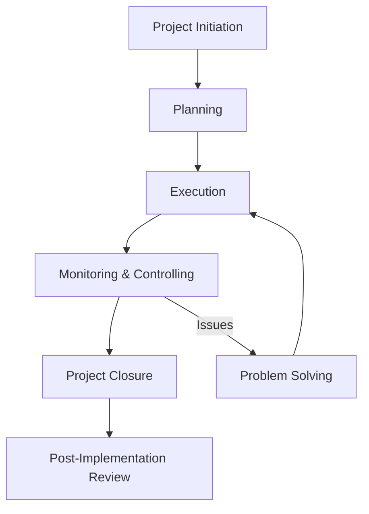
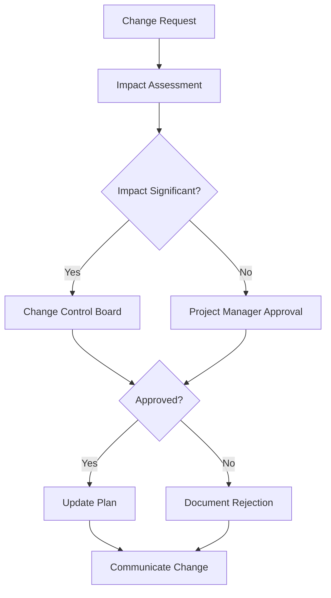

# Project Management SOP

## Document Information
- **SOP ID**: PM-001
- **Version**: 1.0.0
- **Effective Date**: 2024-01-01
- **Owner**: Project Management Office Lead
- **Last Review**: 2024-01-01

## Purpose
Standardize project management practices across all projects to ensure consistent delivery, stakeholder satisfaction, and continuous improvement.

## Scope
This SOP applies to all projects including internal initiatives, client projects, product development, and operational improvements.

## Process Overview



## Detailed Procedures

### 1. Project Initiation

#### 1.1 Project Request Process
```yaml
project_request:
  required_fields:
    - project_name
    - sponsor
    - business_objective
    - expected_outcomes
    - estimated_budget
    - estimated_timeline
    - resource_requirements
    
  prioritization_criteria:
    - strategic_alignment: 30
    - business_impact: 25
    - urgency: 20
    - feasibility: 15
    - roi_potential: 10
    
  submission_channel:
    - project_portal: true
    - email: false
    - verbal: false
```

#### 1.2 Project Charter Template
```markdown
## Project Charter

### Project Information
- **Project Name**: [Name]
- **Project Sponsor**: [Name]
- **Project Manager**: [Name]
- **Date**: [Date]
- **Version**: 1.0

### Business Case
[Why are we doing this? What problem are we solving?]

### Project Objectives
1. [Objective 1 - SMART]
2. [Objective 2 - SMART]
3. [Objective 3 - SMART]

### Scope
**In Scope**:
- [Item 1]
- [Item 2]

**Out of Scope**:
- [Item 1]
- [Item 2]

### Stakeholders
| Role | Name | Responsibility |
|------|------|----------------|
| Sponsor | [Name] | Final approval, escalation |
| PM | [Name] | Day-to-day management |
| Team Lead | [Name] | Technical delivery |
| User Rep | [Name] | Requirements validation |

### Timeline
- **Start Date**: [Date]
- **End Date**: [Date]
- **Key Milestones**: [List]

### Budget
- **Approved Budget**: $[Amount]
- **Contingency**: [Percentage]

### Risks
| Risk | Impact | Probability | Mitigation |
|------|--------|-------------|------------|
| [Risk] | H/M/L | H/M/L | [Strategy] |
```

### 2. Planning

#### 2.1 Requirements Gathering
```json
{
  "requirements_process": {
    "phases": [
      {
        "phase": "Discovery",
        "activities": ["Stakeholder interviews", "Current state analysis"],
        "outputs": ["Discovery report"]
      },
      {
        "phase": "Elicitation",
        "activities": ["Workshops", "Surveys", "Observation"],
        "outputs": ["Requirements backlog"]
      },
      {
        "phase": "Documentation",
        "activities": ["Use cases", "User stories", "SRS"],
        "outputs": ["Requirements document"]
      },
      {
        "phase": "Validation",
        "activities": ["Review", "Prototyping", "Sign-off"],
        "outputs": ["Approved requirements"]
      }
    ]
  }
}
```

#### 2.2 Work Breakdown Structure (WBS)
```yaml
wbs_template:
  level_1: "Project"
  level_2: "Phase"
  level_3: "Deliverable"
  level_4: "Task"
  level_5: "Activity"
  
  numbering: "1.0 -> 1.1 -> 1.1.1 -> 1.1.1.1"
  
  estimation_unit: "hours"
```

#### 2.3 Project Schedule Development
```yaml
schedule_development:
  tools:
    - gantt_chart
    - critical_path
    - resource_leveling
    
  estimation_techniques:
    - three_point: "(O + 4M + P) / 6"
    - analogous: "Historical comparison"
    - parametric: "Unit-based calculation"
    
  contingency_buffer:
    activity_level: "10% of task estimate"
    project_level: "15% of total duration"
```

#### 2.4 Resource Planning
```json
{
  "resource_planning": {
    "roles": [
      {
        "role": "Project Manager",
        "allocation": "100%",
        "skills": ["PM", "Communication"]
      },
      {
        "role": "Developer",
        "allocation": "100%",
        "skills": ["Frontend", "Backend"]
      },
      {
        "role": "Designer",
        "allocation": "50%",
        "skills": ["UI", "UX"]
      }
    ],
    "resource_leveling": {
      "max_daily_hours": 8,
      "max_weekly_hours": 40,
      "overtime_threshold": "Manager approval"
    }
  }
}
```

### 3. Execution

#### 3.1 Kickoff Meeting Agenda
| Time | Topic | Owner |
|------|-------|-------|
| 0-10 min | Welcome and objectives | Sponsor |
| 10-30 min | Project overview | PM |
| 30-50 min | Scope and deliverables | Team |
| 50-70 min | Timeline and milestones | PM |
| 70-85 min | Roles and responsibilities | All |
| 85-100 min | Communication plan | PM |
| 100-120 min | Q&A and next steps | All |

#### 3.2 Status Reporting
```yaml
status_reporting:
  frequency:
    - weekly: "Stakeholder update"
    - daily: "Team standup"
    - bi-weekly: "Executive summary"
    
  format:
    sections:
      - executive_summary
      - accomplishments
      - upcoming_work
      - risks_and_issues
      - budget_status
      - timeline_status
      
  template_file: "templates/status_report.md"
```

#### 3.3 Meeting Cadence
```json
{
  "meeting_cadence": {
    "daily_standup": {
      "frequency": "Daily",
      "duration": "15 minutes",
      "attendees": "Core team",
      "format": "Yesterday, today, blockers"
    },
    "weekly_status": {
      "frequency": "Weekly",
      "duration": "60 minutes",
      "attendees": "PM + Sponsor + Leads",
      "format": "Review, decisions, escalations"
    },
    "bi-weekly_review": {
      "frequency": "Bi-weekly",
      "duration": "90 minutes",
      "attendees": "Full team + stakeholders",
      "format": "Demo, feedback, adjustments"
    },
    "retrospective": {
      "frequency": "At project end",
      "duration": "120 minutes",
      "attendees": "Full team",
      "format": "What went well, what to improve"
    }
  }
}
```

### 4. Monitoring & Controlling

#### 4.1 Performance Metrics
```yaml
project_metrics:
  schedule:
    - planned_vs_actual: "Variance analysis"
    - critical_path_status: "Float remaining"
    - milestone_completion: "Percentage"
    
  cost:
    - planned_vs_actual: "Budget variance"
    - earned_value: "EV, PV, AC"
    - cost_per_deliverable: "Unit cost"
    
  quality:
    - defect_density: "Defects per KLOC"
    - rework_rate: "Percentage of work redone"
    - acceptance_rate: "First-pass approval %"
    
  team:
    - velocity: "Story points per sprint"
    - utilization: "Billable hours percentage"
    - morale: "Survey score"
```

#### 4.2 Change Control


#### 4.3 Issue Management
```json
{
  "issue_management": {
    "logging": {
      "required_fields": ["description", "owner", "priority", "status", "due_date"],
      "optional_fields": ["impact", "root_cause", "resolution"]
    },
    "prioritization": {
      "critical": "Immediate attention, 4-hour response",
      "high": "Same-day resolution",
      "medium": "Within 3 business days",
      "low": "Next release cycle"
    },
    "escalation": {
      "level_1": "Project Manager",
      "level_2": "Department Head",
      "level_3": "Executive Sponsor"
    }
  }
}
```

#### 4.4 Risk Management
```yaml
risk_management:
  identification:
    methods:
      - brainstorming
      - swot_analysis
      - expert_interview
      - historical_review
      
  assessment:
    matrix:
      impact:
        high: "> $50K or >2 weeks delay"
        medium: "$10K-$50K or 1-2 weeks"
        low: "< $10K or <1 week delay"
      probability:
        high: ">60% likelihood"
        medium: "30-60% likelihood"
        low: "<30% likelihood"
        
  response_strategies:
    avoid: "Eliminate the threat"
    mitigate: "Reduce probability/impact"
    transfer: "Shift to third party"
    accept: "Document and monitor"
```

### 5. Project Closure

#### 5.1 Closure Checklist
```yaml
project_closure:
  deliverables:
    - all_deliverables_accepted: true
    - documentation_complete: true
    - lessons_learned_captured: true
    - training_completed: true
    
  administrative:
    - contracts_closed: true
    - final_invoices_sent: true
    - resources_released: true
    - project_archive_created: true
    
  communication:
    - final_report_distributed: true
    - stakeholder_notification: true
    - celebration_conducted: true
    
  financial:
    - budget_finalized: true
    - variance_explained: true
    - savings_returned: true
```

#### 5.2 Post-Implementation Review
```markdown
## Post-Implementation Review

### Project: [Name]
### Date: [Date]
### Reviewer: [Name]

### Executive Summary
[Overall assessment of project outcomes]

### Objectives vs. Outcomes
| Objective | Target | Actual | Status |
|-----------|--------|--------|--------|
| [Obj 1] | [Target] | [Actual] | 🟢/🟡/🔴 |
| [Obj 2] | [Target] | [Actual] | 🟢/🟡/🔴 |

### Budget Performance
| Category | Budget | Actual | Variance |
|----------|--------|--------|----------|
| [Cat 1] | $[X] | $[X] | [X]% |
| [Cat 2] | $[X] | $[X] | [X]% |

### Timeline Performance
- Planned Duration: [X] weeks
- Actual Duration: [X] weeks
- Variance: [X]%

### Lessons Learned
**What Went Well**:
1. [Lesson 1]
2. [Lesson 2]

**What To Improve**:
1. [Lesson 1]
2. [Lesson 2]

**Recommendations**:
1. [Recommendation 1]
2. [Recommendation 2]

### Team Recognition
[Team members who excelled]

### Final Sign-off
| Role | Name | Date |
|------|------|------|
| Project Manager | | |
| Sponsor | | |
```

## Automation Triggers

| Trigger | Action | Owner |
|---------|--------|-------|
| Project approved | Create project space | System |
| Milestone due | Send reminder | System |
| Task overdue | Alert assignee + PM | System |
| Issue logged | Notify owner | System |
| Risk exceeds threshold | Escalate to sponsor | System |
| Project closed | Archive and notify | System |

## Metrics & KPIs

| Metric | Target | Measurement Frequency |
|--------|--------|----------------------|
| On-Time Delivery | >90% | Per project |
| Budget Adherence | >95% | Per project |
| Scope Creep | <5% | Per project |
| Stakeholder Satisfaction | >4.5/5 | Post-project |
| Team Satisfaction | >4.0/5 | Quarterly |
| Quality (Defects) | <2% | Per release |
| Benefit Realization | >80% | 6 months post |

## Roles & Responsibilities

| Role | Responsibilities |
|------|------------------|
| Executive Sponsor | Strategic direction, resource allocation, escalation |
| Project Manager | Day-to-day management, stakeholder communication |
| Team Lead | Technical delivery, team coordination |
| Subject Matter Expert | Requirements, domain knowledge |
| Project Management Office | Methodology, tools, governance |

## Compliance Requirements

- [ ] Project methodology followed
- [ ] Documentation standards met
- [ ] Change control process followed
- [ ] Risk register maintained
- [ ] Stakeholder communication completed
- [ ] Closure checklist executed

## References

- Project Charter Template
- Status Report Template
- Risk Register Template
- Lessons Learned Template

---

*Document Version: 1.0.0*
*Last Updated: 2024-01-01*
*Next Review: 2024-04-01*
