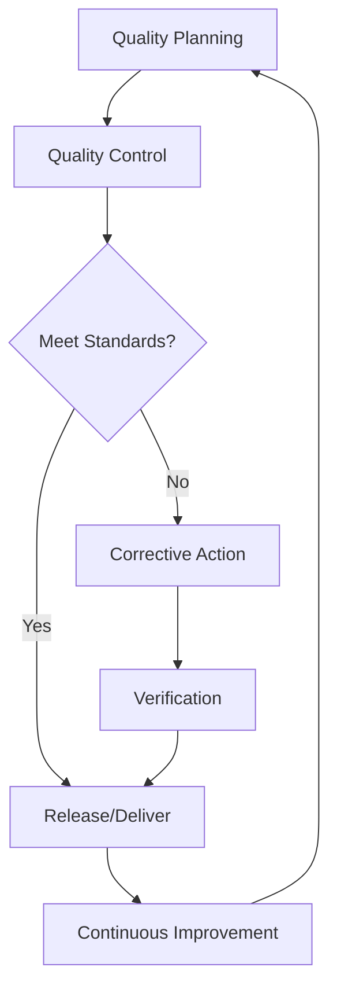
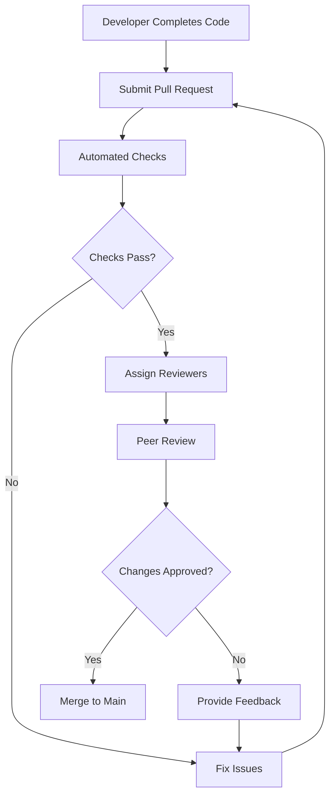
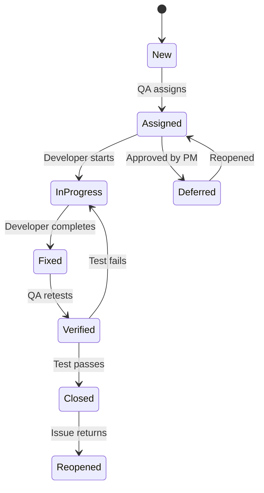

# Quality Assurance SOP

## Document Information
- **SOP ID**: QA-001
- **Version**: 1.0.0
- **Effective Date**: 2024-01-01
- **Owner**: Quality Assurance Lead
- **Last Review**: 2024-01-01

## Purpose
Establish comprehensive quality assurance processes to ensure all deliverables meet established standards, customer expectations, and regulatory requirements.

## Scope
This SOP covers product quality, service quality, document quality, process compliance, and continuous improvement initiatives.

## Process Overview



## Detailed Procedures

### 1. Quality Planning

#### 1.1 Quality Standards Definition
```yaml
quality_standards:
  product:
    functional_completeness: ">99% requirements coverage"
    defect_density: "<1 defect per 1000 lines"
    uptime_reliability: "99.9% availability"
    performance_response: "<200ms average"
    
  service:
    response_time: "<4 hours for P2"
    resolution_time: "<24 hours for P2"
    customer_satisfaction: ">90% positive"
    first_contact_resolution: ">80%"
    
  document:
    accuracy: "100% factual correctness"
    completeness: "All required sections present"
    consistency: "Style guide compliance"
    accessibility: "WCAG 2.1 AA compliance"
```

#### 1.2 Quality Management Plan Template
```markdown
## Quality Management Plan

### Project: [Name]
### Version: 1.0
### Date: [Date]

### Quality Objectives
| Objective | Metric | Target | Measurement Method |
|-----------|--------|--------|-------------------|
| [Obj 1] | [Metric] | [Target] | [Method] |
| [Obj 2] | [Metric] | [Target] | [Method] |

### Quality Standards
**Applicable Standards**:
- [Standard 1]
- [Standard 2]

**Compliance Requirements**:
- [Requirement 1]
- [Requirement 2]

### Quality Activities
| Activity | Owner | Frequency | Output |
|----------|-------|-----------|--------|
| Code Review | Dev Lead | Per commit | Feedback |
| Testing | QA Team | Per release | Report |
| Audit | QA Lead | Monthly | Findings |

### Quality Metrics
| Metric | Target | Threshold | Owner |
|--------|--------|-----------|-------|
| Test Coverage | >80% | <70% | QA Lead |
| Bug Escape Rate | <5% | >10% | QA Lead |
| Customer Bugs | <2/month | >5/month | PM |

### Risk Management
| Risk | Impact | Mitigation |
|------|--------|------------|
| [Risk] | [H/M/L] | [Strategy] |
```

### 2. Quality Control

#### 2.1 Testing Types
```json
{
  "testing_types": {
    "unit_testing": {
      "scope": "Individual components",
      "owner": "Developer",
      "frequency": "Per commit",
      "automation": "Required"
    },
    "integration_testing": {
      "scope": "Component interactions",
      "owner": "QA Engineer",
      "frequency": "Per build",
      "automation": "Required"
    },
    "system_testing": {
      "scope": "Complete system",
      "owner": "QA Engineer",
      "frequency": "Per release",
      "automation": "Semi-automated"
    },
    "acceptance_testing": {
      "scope": "Business requirements",
      "owner": "Business Analyst",
      "frequency": "Per release",
      "automation": "Manual"
    },
    "performance_testing": {
      "scope": "Load and stress",
      "owner": "Performance Engineer",
      "frequency": "Major releases",
      "automation": "Required"
    },
    "security_testing": {
      "scope": "Vulnerabilities",
      "owner": "Security Team",
      "frequency": "Per release + continuous",
      "automation": "Required"
    }
  }
}
```

#### 2.2 Code Review Process


#### 2.3 Code Review Checklist
```yaml
code_review_checklist:
  functionality:
    - code_meets_requirements: true
    - edge_cases_handled: true
    - error_handling_implemented: true
    - security_considerations: true
    
  quality:
    - code_follows_standards: true
    - naming_conventions: true
    - documentation_complete: true
    - no_duplicate_code: true
    
  performance:
    - efficient_algorithms: true
    - proper_indexing: true
    - resource_cleanup: true
    - no_memory_leaks: true
    
  testing:
    - unit_tests_pass: true
    - test_coverage_adequate: true
    - edge_cases_tested: true
```

### 3. Document Review

#### 3.1 Document Review Workflow
```yaml
document_review:
  stages:
    - draft: "Author creates initial version"
    - technical_review: "Subject matter expert validates"
    - editorial_review: "Editor checks style and grammar"
    - compliance_review: "Legal/regulatory check"
    - final_approval: "Authorized approver signs off"
    
  required_reviews:
    technical_documents: ["Tech Review", "Editorial"]
    marketing_documents: ["Marketing Lead", "Legal"]
    legal_documents: ["Legal Counsel", "Compliance"]
    customer_documents: ["SME", "Legal", "Customer Rep"]
```

#### 3.2 Document Quality Criteria
```json
{
  "document_quality": {
    "accuracy": {
      "criteria": ["Facts verified", "Data sourced", "Calculations correct"],
      "threshold": "100% accuracy required"
    },
    "completeness": {
      "criteria": ["All sections present", "Required fields filled", "References included"],
      "threshold": "100% completeness required"
    },
    "consistency": {
      "criteria": ["Style guide followed", "Terminology consistent", "Formatting uniform"],
      "threshold": "<3 inconsistencies allowed"
    },
    "clarity": {
      "criteria": ["Easy to understand", "Logical flow", "Appropriate detail level"],
      "threshold": "Readability score >60"
    }
  }
}
```

### 4. Defect Management

#### 4.1 Defect Classification
```yaml
defect_classification:
  severity:
    critical:
      description: "System down, data loss, security breach"
      response_time: "1 hour"
      resolution_target: "4 hours"
      escalation: "Immediate to leadership"
      
    high:
      description: "Major feature broken, no workaround"
      response_time: "4 hours"
      resolution_target: "24 hours"
      escalation: "Next day if not resolved"
      
    medium:
      description: "Feature impaired, workaround exists"
      response_time: "8 hours"
      resolution_target: "3 business days"
      escalation: "Weekly review"
      
    low:
      description: "Minor issue, cosmetic"
      response_time: "24 hours"
      resolution_target: "Next release"
      escalation: "Backlog grooming"
```

#### 4.2 Defect Lifecycle


#### 4.3 Defect Report Template
```markdown
## Defect Report

### Defect ID: [System Generated]
### Date Reported: [Date]
### Reporter: [Name]

### Description
**Summary**: [Brief title]
**Steps to Reproduce**:
1. [Step 1]
2. [Step 2]
3. [Step 3]

**Expected Result**: [What should happen]
**Actual Result**: [What actually happened]

### Environment
- **Environment**: [Prod/Staging/Dev]
- **Version**: [X.X.X]
- **Browser/Device**: [If applicable]
- **OS**: [If applicable]

### Classification
- **Severity**: [Critical/High/Medium/Low]
- **Priority**: [P1/P2/P3/P4]
- **Module**: [Component name]

### Attachments
- [Screenshot]
- [Log file]
- [Video recording]

### Resolution
**Fixed By**: [Name]
**Fix Date**: [Date]
**Resolution Summary**: [Brief description]
```

### 5. Compliance Checking

#### 5.1 Compliance Requirements Matrix
```json
{
  "compliance_matrix": {
    "regulatory": {
      "gdpr": {
        "scope": "EU customer data",
        "requirements": ["Consent management", "Data deletion", "Portability"],
        "audit_frequency": "Annual"
      },
      "ccpa": {
        "scope": "California consumer data",
        "requirements": ["Disclosure", "Opt-out", "Access"],
        "audit_frequency": "Annual"
      }
    },
    "industry": {
      "soc2": {
        "scope": "Service organization",
        "requirements": ["Security controls", "Availability", "Confidentiality"],
        "audit_frequency": "Annual"
      }
    },
    "internal": {
      "data_handling": {
        "scope": "All data",
        "requirements": ["Classification", "Encryption", "Access control"],
        "audit_frequency": "Quarterly"
      }
    }
  }
}
```

#### 5.2 Compliance Checklist
```yaml
compliance_checklist:
  pre_release:
    - security_scan_complete: true
    - privacy_check_complete: true
    - accessibility_check_complete: true
    - license_compliance_verified: true
    
  documentation:
    - terms_of_service_updated: true
    - privacy_policy_updated: true
    - data_processing_agreement: true
    - security_documentation: true
    
  testing:
    - penetration_test_complete: true
    - vulnerability_scan_complete: true
    - code_security_review_complete: true
```

#### 5.3 Audit Process
```yaml
audit_process:
  preparation:
    - define_audit_scope: true
    - gather_evidence: true
    - prepare_documentation: true
    
  execution:
    - conduct_interviews: true
    - review_controls: true
    - test_effectiveness: true
    
  reporting:
    - document_findings: true
    - risk_rating: true
    - recommendations: true
    
  follow_up:
    - remediation_plan: true
    - timeline_agreement: true
    - verification_testing: true
```

### 6. Continuous Improvement

#### 6.1 Root Cause Analysis
```json
{
  "root_cause_analysis": {
    "methods": [
      "5 Whys",
      "Fishbone Diagram",
      "Pareto Analysis",
      "Fault Tree Analysis"
    ],
    "process": {
      "step_1": "Identify the problem",
      "step_2": "Gather data",
      "step_3": "Identify possible causes",
      "step_4": "Determine root cause",
      "step_5": "Develop solutions",
      "step_6": "Implement and verify"
    }
  }
}
```

#### 6.2 Improvement Initiatives
```yaml
improvement_initiatives:
  quarterly_review:
    - analyze_metrics: true
    - identify_trends: true
    - prioritize_improvements: true
    - assign_owners: true
    
  kaizen_events:
    - frequency: "Quarterly",
    - duration: "2 days",
    - focus: "Process improvement",
    - output: "Action items"
    
  lessons_learned:
    - capture_frequency: "Per project + quarterly",
    - review_process: "Team retrospective",
    - documentation: "Repository update",
    - verification: "Process change implemented"
```

## Automation Triggers

| Trigger | Action | Owner |
|---------|--------|-------|
| Test completed | Generate report | System |
| Critical defect | Alert team lead | System |
| Release candidate | Run full QA suite | System |
| Compliance scan | Generate findings report | System |
| Audit scheduled | Prepare evidence | System |
| Metrics threshold breach | Trigger RCA | System |

## Metrics & KPIs

| Metric | Target | Measurement Frequency |
|--------|--------|----------------------|
| Test Coverage | >80% | Per release |
| Defect Escape Rate | <5% | Per release |
| First-Time-Right | >90% | Per release |
| Customer-Reported Bugs | <2/month | Monthly |
| QA Cycle Time | <5 days | Per release |
| Compliance Score | 100% | Quarterly |
| Process Adherence | >95% | Monthly |

## Roles & Responsibilities

| Role | Responsibilities |
|------|------------------|
| QA Lead | Strategy, standards, team management |
| QA Engineer | Test design, execution, defect tracking |
| Developer | Unit testing, code quality |
| Product Owner | Acceptance criteria, prioritization |
| Release Manager | Release coordination, governance |

## Compliance Requirements

- [ ] Testing standards followed
- [ ] Documentation complete
- [ ] Defects properly classified
- [ ] Root cause analysis conducted
- [ ] Continuous improvement tracked
- [ ] Audit readiness maintained

## References

- Test Case Templates
- Defect Management Guide
- Compliance Checklist
- Root Cause Analysis Framework

---

*Document Version: 1.0.0*
*Last Updated: 2024-01-01*
*Next Review: 2024-04-01*