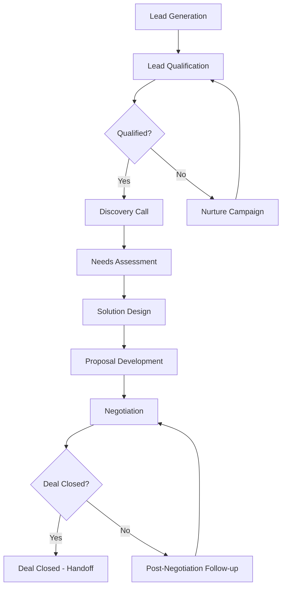

# Sales Pipeline SOP

## Document Information
- **SOP ID**: SAL-001
- **Version**: 1.0.0
- **Effective Date**: 2024-01-01
- **Owner**: Sales Team Lead
- **Last Review**: 2024-01-01

## Purpose
Define the standardized sales pipeline process from lead generation to deal closure, ensuring consistency, efficiency, and measurable outcomes.

## Scope
This SOP applies to all sales activities including lead qualification, opportunity management, proposal development, negotiation, and closing.

## Process Overview



## Detailed Procedures

### 1. Lead Generation

#### 1.1 Lead Sources
| Source Type | Description | Target % |
|-------------|-------------|----------|
| Inbound | Website, content, referrals | 40% |
| Outbound | Cold outreach, campaigns | 30% |
| Partners | Channel partnerships | 20% |
| Events | Conferences, webinars | 10% |

#### 1.2 Lead Capture Criteria
- **Required Fields**: Name, email, company, source
- **Optional Fields**: Phone, job title, budget, timeline
- **Enrichment**: Auto-enrich with company data using integration

#### 1.3 Lead Assignment Rules
```json
{
  "assignment_rules": {
    "territory_based": true,
    "industry_specialization": true,
    "account_size": {
      "enterprise": "Senior AE",
      "mid_market": "AE",
      "smb": "SDR"
    }
  }
}
```

### 2. Lead Qualification

#### 2.1 BANT Criteria
| Criteria | Description | Weight |
|----------|-------------|--------|
| Budget | Confirmed budget allocation | 25% |
| Authority | Access to decision makers | 25% |
| Need | Clear business problem | 25% |
| Timeline | Defined implementation timeline | 25% |

#### 2.2 Qualification Score Threshold
- **Minimum Score**: 70/100 to advance
- **Review Required**: 50-69 score (manager review)
- **Disqualify**: Below 50 score

#### 2.3 Qualification Actions
```python
def qualify_lead(lead_data):
    score = calculate_bant_score(lead_data)
    
    if score >= 70:
        return {
            "status": "qualified",
            "action": "schedule_discovery",
            "assign_to": "account_executive"
        }
    elif score >= 50:
        return {
            "status": "review_required",
            "action": "manager_review",
            "escalate": true
        }
    else:
        return {
            "status": "disqualified",
            "action": "nurture_campaign",
            "move_to": "marketing_queue"
        }
```

### 3. Discovery Call

#### 3.1 Pre-Call Preparation
- [ ] Review lead background and company research
- [ ] Prepare tailored questions
- [ ] Set up demo environment (if applicable)
- [ ] Review competitive positioning

#### 3.2 Discovery Call Agenda (45 min)
| Time | Topic | Owner |
|------|-------|-------|
| 0-5 min | Introduction and agenda | AE |
| 5-20 min | Customer situation and challenges | Customer |
| 20-35 min | Discovery questions and needs assessment | AE |
| 35-40 min | Proposed approach overview | AE |
| 40-45 min | Next steps and timeline | Both |

#### 3.3 Post-Call Actions
- [ ] Log notes in CRM within 24 hours
- [ ] Send thank you email with summary
- [ ] Schedule follow-up or proposal meeting
- [ ] Update lead status

### 4. Needs Assessment

#### 4.1 Assessment Framework
1. **Business Objectives**: What are they trying to achieve?
2. **Current State**: What are they doing today?
3. **Pain Points**: What challenges are they facing?
4. **Success Metrics**: How will they measure success?
5. **Decision Process**: Who is involved and timeline?

#### 4.2 Documentation Requirements
- Current state assessment
- Gap analysis
- Proposed solution requirements
- Success criteria definition

### 5. Solution Design

#### 5.1 Design Process
1. Internal solution team kickoff
2. Technical requirements gathering
3. Solution architecture development
4. Resource and timeline estimation
5. Internal review and approval
6. Client presentation preparation

#### 5.2 Design Approval Matrix
| Deal Size | Approver |
|-----------|----------|
| <$10K | Sales Manager |
| $10K-$50K | Sales Director |
| $50K-$100K | VP Sales |
| >$100K | CRO + Legal |

### 6. Proposal Development

#### 6.1 Proposal Template
- Executive Summary
- Understanding & Objectives
- Proposed Solution
- Investment & ROI
- Timeline & Implementation
- Terms & Conditions
- Case Studies

#### 6.2 Pricing Approval
```json
{
  "pricing_approval": {
    "standard_discount": 0.1,
    "manager_approval": 0.2,
    "director_approval": 0.3,
    "vp_approval": 0.4,
    "custom_terms": "legal_review"
  }
}
```

### 7. Negotiation

#### 7.1 Negotiation Framework
1. **Understand Position**: What do they really need?
2. **Identify BATNA**: Best alternative to negotiated agreement
3. **Create Value**: Focus on outcomes, not features
4. **Manage Terms**: Know your walk-away points
5. **Escalate Wisely**: Use internal resources strategically

#### 7.2 Escalation Triggers
- Price reduction >20%
- Contract length <12 months
- Custom terms or SLAs
- Competitive pressure

### 8. Deal Closure

#### 8.1 Close Checklist
- [ ] Signed MSA/Contract
- [ ] Purchase order received
- [ ] Deposit/Payment processed
- [ ] Handoff to implementation team
- [ ] Internal deal review scheduled

#### 8.2 Deal Registration
```yaml
deal_registration:
  required_fields:
    - customer_name
    - deal_value
    - close_date
    - primary_contact
    - implementation_lead
  auto_actions:
    - create_project
    - notify_finance
    - schedule_kickoff
```

## Metrics & KPIs

| Metric | Target | Measurement Frequency |
|--------|--------|----------------------|
| Lead Response Time | <2 hours | Daily |
| Qualified Lead Rate | >40% | Weekly |
| Opportunity Conversion | >25% | Monthly |
| Average Sales Cycle | <45 days | Monthly |
| Average Deal Size | $XX,XXX | Monthly |
| Win Rate | >35% | Quarterly |

## Automation Triggers

| Trigger | Action | Owner |
|---------|--------|-------|
| New lead captured | Auto-assign based on territory | System |
| Lead qualified | Create opportunity record | System |
| Proposal sent | Update stage to negotiation | System |
| Deal won | Trigger onboarding workflow | System |
| Deal lost | Log feedback, update forecast | AE |

## Compliance Requirements

- [ ] All deals logged in CRM within 24 hours
- [ ] Weekly pipeline review with manager
- [ ] Forecast accuracy within 10%
- [ ] Deal registration before commitment
- [ ] Contract compliance review

## Training & Certification

- **Required**: Sales Methodology Training (Week 1)
- **Required**: Product Knowledge Certification (Week 2)
- **Recommended**: Negotiation Skills Workshop (Monthly)

## References

- Sales Playbook (internal wiki)
- Pricing Guide
- Competitive Battle Cards
- Objection Handling Guide

---

*Document Version: 1.0.0*
*Last Updated: 2024-01-01*
*Next Review: 2024-04-01*
