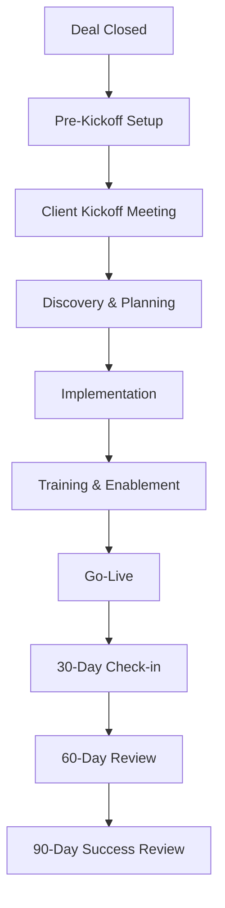

# Client Onboarding SOP

## Document Information
- **SOP ID**: ONB-001
- **Version**: 1.0.0
- **Effective Date**: 2024-01-01
- **Owner**: Client Success Team Lead
- **Last Review**: 2024-01-01

## Purpose
Standardize the client onboarding process to ensure consistent, efficient, and successful client integration, maximizing early adoption and long-term satisfaction.

## Scope
This SOP applies to all new client implementations including enterprise accounts, SMB clients, and partner-driven onboardings.

## Process Overview



## Detailed Procedures

### 1. Pre-Kickoff Setup (Day 0-2)

#### 1.1 Internal Handoff Checklist
```yaml
handoff_checklist:
  received_from_sales:
    - signed_contract: true
    - sow_completed: true
    - customer_contacts: ["primary", "technical", "executive"]
    - special_terms: []
    
  internal_setup:
    - create_customer_account: true
    - assign_cs_manager: true
    - setup_billing: true
    - create_project_folder: true
    - schedule_kickoff: true
```

#### 1.2 Client Communication Template
```
Subject: Welcome to [Company] - Onboarding Kickoff Scheduled

Dear [Client Name],

Congratulations on your decision to partner with [Company]! We're excited to help you achieve your goals.

Your onboarding journey begins with a kickoff meeting where we'll:
- Introduce your dedicated team
- Review your objectives and timeline
- Align on communication preferences
- Confirm your implementation plan

Kickoff Meeting Details:
- Date: [Date]
- Time: [Time]
- Attendees: [List]

Please confirm your availability and send any initial questions.

Best regards,
[CS Manager Name]
```

### 2. Client Kickoff Meeting (Day 3-5)

#### 2.1 Kickoff Agenda (60 min)
| Time | Topic | Description |
|------|-------|-------------|
| 0-10 min | Welcome & Introductions | Team roles and relationships |
| 10-25 min | Success Goals | Client objectives and KPIs |
| 25-40 min | Implementation Overview | Timeline and milestones |
| 40-50 min | Communication Plan | Channels, frequency, contacts |
| 50-60 min | Q&A and Next Steps | Action items and ownership |

#### 2.2 Kickoff Deliverables
- [ ] Signed Kickoff Summary
- [ ] Communication Preferences Form
- [ ] Technical Requirements Document
- [ ] Initial Project Schedule

### 3. Discovery & Planning (Week 1-2)

#### 3.1 Stakeholder Interviews
| Stakeholder | Focus Area | Duration |
|-------------|------------|----------|
| Executive Sponsor | Business outcomes, success metrics | 30 min |
| Project Manager | Timeline, resources, logistics | 45 min |
| Technical Lead | Integration, technical requirements | 60 min |
| End Users | Workflow, usability, training needs | 30 min each |

#### 3.2 Implementation Plan Template
```markdown
## Implementation Plan: [Client Name]

### Executive Summary
- **Client**: [Name]
- **CS Manager**: [Name]
- **Project Duration**: [X] weeks
- **Go-Live Target**: [Date]

### Phase 1: Foundation (Week 1-2)
- [ ] Account configuration
- [ ] User permissions setup
- [ ] Integration setup
- [ ] Data migration start

### Phase 2: Configuration (Week 3-4)
- [ ] Custom workflows
- [ ] Reports and dashboards
- [ ] Automated processes
- [ ] User acceptance testing

### Phase 3: Training (Week 5-6)
- [ ] Admin training
- [ ] End user training
- [ ] Documentation delivery
- [ ] Go-live preparation

### Success Criteria
1. [Criteria 1]
2. [Criteria 2]
3. [Criteria 3]

### Risks and Mitigations
| Risk | Impact | Probability | Mitigation |
|------|--------|-------------|------------|
| [Risk] | [High/Med/Low] | [High/Med/Low] | [Strategy] |
```

### 4. Implementation (Week 3-6)

#### 4.1 Configuration Standards
```json
{
  "configuration_checklist": {
    "account_settings": {
      "timezone": "client_timezone",
      "currency": "client_currency",
      "language": "primary_language",
      "date_format": "locale_specific"
    },
    "user_management": {
      "sso_enabled": true,
      "mfa_required": true,
      "provisioning": "automated"
    },
    "integrations": {
      "primary_crm": "integrate",
      "email": "integrate",
      "calendar": "integrate",
      "slack": "integrate"
    }
  }
}
```

#### 4.2 Data Migration Protocol
1. **Data Assessment**: Identify data sources and volume
2. **Mapping**: Define field mappings between systems
3. **Validation**: Create validation rules and checksums
4. **Migration Window**: Schedule and execute migration
5. **Verification**: Confirm data integrity post-migration
6. **User Access**: Grant access to migrated data

#### 4.3 Testing Requirements
- [ ] Functional testing (all features)
- [ ] Integration testing (connected systems)
- [ ] Performance testing (load and speed)
- [ ] Security testing (access controls)
- [ ] User acceptance testing (business scenarios)

### 5. Training & Enablement (Week 5-6)

#### 5.1 Training Curriculum
| Role | Training Modules | Duration |
|------|------------------|----------|
| Administrator | System Admin, Configuration, User Management | 8 hours |
| Power User | Advanced Features, Reporting, Automation | 4 hours |
| Standard User | Core Features, Daily Workflows | 2 hours |
| Executive | Reports, Dashboards, ROI Tracking | 1 hour |

#### 5.2 Training Delivery Options
- **Live Virtual**: Scheduled sessions with Q&A
- **Self-Paced**: Recorded modules in learning portal
- **Documentation**: Written guides and FAQs
- **In-Person**: On-site sessions (enterprise only)

#### 5.3 Enablement Checklist
```yaml
enablement_delivered:
  documentation:
    - user_guide: true
    - admin_guide: true
    - faq_document: true
    - video_tutorials: []
    
  access:
    - help_center: true
    - support_portal: true
    - community_access: true
    
  certification:
    - admin_certification: false
    - user_certification: false
```

### 6. Go-Live (Week 6)

#### 6.1 Go-Live Checklist
```yaml
go_live_checklist:
  technical_readiness:
    - all_tests_passed: true
    - integrations_verified: true
    - data_migration_complete: true
    - performance_baseline: established
    
  user_readiness:
    - training_completed: true
    - documentation_distributed: true
    - helpdesk_notified: true
    - super_users_identified: true
    
  communication:
    - go_live_announcement: prepared
    - support_contacts_shared: true
    - escalation_path_defined: true
```

#### 6.2 Go-Live Support Plan
- **Week 1**: Dedicated support coverage (24/7)
- **Week 2**: Extended hours support (business hours + on-call)
- **Week 3+**: Standard support hours

### 7. Post-Go-Live Reviews

#### 7.1 30-Day Check-In
| Area | Questions | Action |
|------|-----------|--------|
| Adoption | Daily active users, feature usage | Address training gaps |
| Satisfaction | NPS score, feedback collection | Escalate concerns |
| Issues | Bug reports, support tickets | Prioritize fixes |
| Outcomes | Progress against success metrics | Adjust strategy |

#### 7.2 60-Day Review
- Deep dive into analytics and adoption metrics
- Identify power users and advocates
- Plan for expansion opportunities
- Gather case study material

#### 7.3 90-Day Success Review
```markdown
## 90-Day Success Review

### Client: [Name]
### Review Date: [Date]
### CS Manager: [Name]

### Executive Summary
[Overall status and key achievements]

### Success Metrics
| Metric | Target | Actual | Status |
|--------|--------|--------|--------|
| Adoption Rate | 80% | XX% | 🟢/🟡/🔴 |
| User Satisfaction | 8/10 | X.X | 🟢/🟡/🔴 |
| Time to Value | <30 days | XX days | 🟢/🟡/🔴 |
| Support Ticket Volume | <10/week | XX | 🟢/🟡/🔴 |

### Wins
1. [Achievement 1]
2. [Achievement 2]
3. [Achievement 3]

### Challenges
1. [Challenge 1] - [Resolution]
2. [Challenge 2] - [Resolution]

### Next Steps
- [Action 1]
- [Action 2]
- [Action 3]
```

## Automation Triggers

| Trigger | Action | Owner |
|---------|--------|-------|
| Deal won | Create onboarding project | System |
| Kickoff scheduled | Send calendar invite | System |
| Training completed | Update progress tracker | System |
| Go-live achieved | Trigger 30-day reminder | System |
| NPS submitted | Alert CSM if <7 | System |

## Metrics & KPIs

| Metric | Target | Measurement Frequency |
|--------|--------|----------------------|
| Time to Go-Live | <45 days | Per project |
| Training Completion | >90% | Weekly |
| 30-Day Adoption Rate | >70% | Monthly |
| NPS Score | >50 | Quarterly |
| Support Ticket Resolution | <24 hours | Weekly |
| Client Satisfaction (CSAT) | >4.5/5 | Per interaction |

## Roles & Responsibilities

| Role | Responsibilities |
|------|------------------|
| Client Success Manager | Overall ownership, relationship management |
| Implementation Specialist | Technical setup, integrations, data migration |
| Training Specialist | Training delivery, enablement materials |
| Support Engineer | Issue resolution, go-live support |
| Sales Account Executive | Escalation point, expansion opportunities |

## Compliance Requirements

- [ ] Contract terms documented in project
- [ ] Data migration with security compliance
- [ ] Training completion tracked
- [ ] Success metrics defined and reviewed
- [ ] All stakeholder communication logged

## References

- Implementation Playbook
- Training Materials Library
- Best Practices Guide
- Integration Documentation

---

*Document Version: 1.0.0*
*Last Updated: 2024-01-01*
*Next Review: 2024-04-01*
