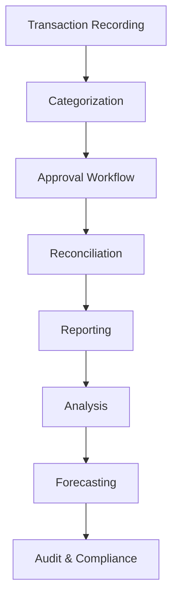
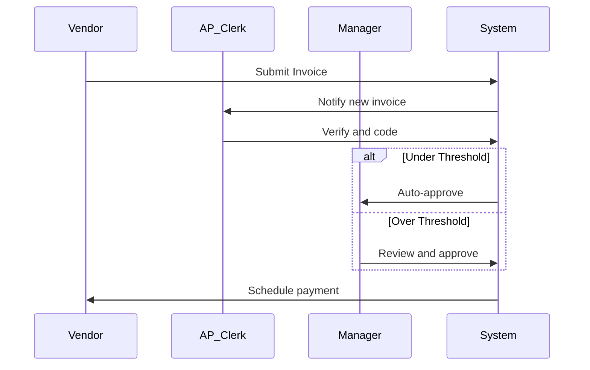
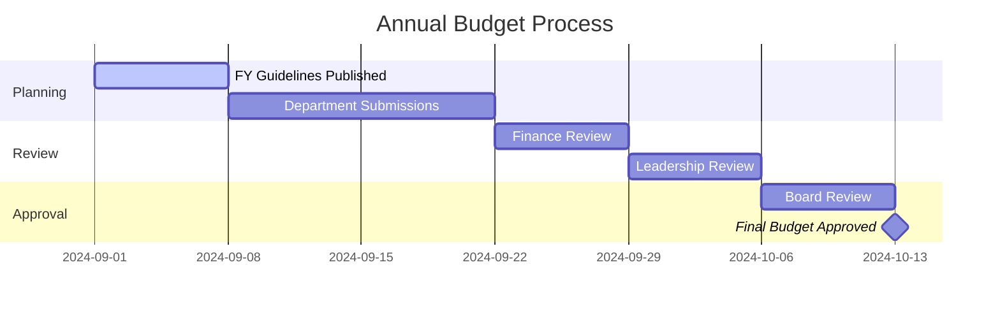

# Financial Tracking SOP

## Document Information
- **SOP ID**: FIN-001
- **Version**: 1.0.0
- **Effective Date**: 2024-01-01
- **Owner**: Finance Team Lead
- **Last Review**: 2024-01-01

## Purpose
Ensure accurate, compliant, and timely financial tracking, reporting, and management across all business operations.

## Scope
This SOP covers accounts payable, accounts receivable, expense management, budgeting, forecasting, and financial reporting.

## Process Overview



## Detailed Procedures

### 1. Transaction Recording

#### 1.1 Recording Standards
```yaml
recording_standards:
  required_fields:
    - date: "YYYY-MM-DD"
    - description: "Clear, concise"
    - amount: "Absolute value with sign"
    - category: "Standardized category"
    - project_code: "If applicable"
    - vendor/client: "Entity name"
    - payment_method: "Cash/Bank/Card"
    - documentation: "Receipt/Invoice attached"
    
  timing:
    revenue: "Within 24 hours"
    expenses: "Within 48 hours"
    transfers: "Within 24 hours"
```

#### 1.2 Chart of Accounts
```json
{
  "chart_of_accounts": {
    "assets": {
      "1000-1999": {
        "1000": "Cash and Cash Equivalents",
        "1100": "Accounts Receivable",
        "1200": "Prepaid Expenses",
        "1300": "Fixed Assets",
        "1400": "Accumulated Depreciation"
      }
    },
    "liabilities": {
      "2000-2999": {
        "2000": "Accounts Payable",
        "2100": "Accrued Expenses",
        "2200": "Deferred Revenue",
        "2300": "Long-term Debt"
      }
    },
    "equity": {
      "3000-3999": {
        "3000": "Common Stock",
        "3100": "Retained Earnings",
        "3200": "Owner Distributions"
      }
    },
    "revenue": {
      "4000-4999": {
        "4000": "Product Revenue",
        "4100": "Service Revenue",
        "4200": "Subscription Revenue",
        "4300": "Other Revenue"
      }
    },
    "expenses": {
      "5000-9999": {
        "5000": "Cost of Goods Sold",
        "6000": "Salaries and Wages",
        "6100": "Marketing and Advertising",
        "6200": "Rent and Utilities",
        "6300": "Office Supplies",
        "6400": "Travel and Entertainment",
        "6500": "Professional Services",
        "6600": "Technology and Software",
        "7000": "Depreciation",
        "8000": "Interest Expense",
        "9000": "Other Expenses"
      }
    }
  }
}
```

### 2. Accounts Payable

#### 2.1 Invoice Processing


#### 2.2 Approval Thresholds
| Amount | Approver | Timeline |
|--------|----------|----------|
| <$1,000 | AP Clerk | 5 business days |
| $1,000-$10,000 | Finance Manager | 3 business days |
| $10,000-$50,000 | Controller | 2 business days |
| >$50,000 | CFO + CEO | 1 business day |

#### 2.3 Payment Terms Management
```yaml
payment_terms:
  standard:
    net_30: "1% discount if paid in 10 days"
    net_45: "Standard terms"
    net_60: "Extended terms"
    
  early_payment:
    threshold: 10000
    discount: 0.02
    deadline: 10_days
    
  missed_payment:
    penalty: "1.5% monthly"
    escalation: "After 15 days past due"
```

### 3. Accounts Receivable

#### 3.1 Invoice Generation
```yaml
invoice_generation:
  triggers:
    - milestone_completed
    - delivery_confirmed
    - subscription_renewal
    - contract_renewal
    
  required_fields:
    - customer_name
    - invoice_number
    - invoice_date
    - due_date
    - line_items
    - subtotal
    - tax
    - total
    
  distribution:
    email: true
    portal: true
    mail: false
```

#### 3.2 Collection Workflow
```json
{
  "collection_workflow": {
    "day_0": "Invoice sent",
    "day_1": "Payment confirmation request",
    "day_7": "Friendly reminder",
    "day_14": "Past due notice",
    "day_21": "Payment plan offer",
    "day_30": "Collections escalation",
    "day_60": "Legal review",
    "day_90": "Write-off decision"
  }
}
```

### 4. Expense Management

#### 4.1 Expense Submission
```yaml
expense_submission:
  required_fields:
    - date: "YYYY-MM-DD"
    - merchant: "Vendor name"
    - category: "Standardized category"
    - amount: "Total including tax"
    - description: "Business purpose"
    - project_code: "If billable"
    - receipt: "Scan/photo attached"
    
  limits:
    meals: 75_per_day
    travel: "Company policy"
    entertainment: 50_per_person
    
  prohibited:
    - personal_items
    - luxury_expenses
    - cash_advances
```

#### 4.2 Expense Approval Matrix
| Amount | Approver | Policy |
|--------|----------|--------|
| <$100 | Self-approval | Receipt required |
| $100-$500 | Team Lead | Receipt + description |
| $500-$2,000 | Department Manager | Receipt + business case |
| >$2,000 | Finance + VP | Full review required |

### 5. Budgeting

#### 5.1 Annual Budget Process


#### 5.2 Budget Templates
```yaml
department_budget:
  header:
    department: "Name"
    fiscal_year: "YYYY"
    prepared_by: "Name"
    date: "YYYY-MM-DD"
    
  sections:
    personnel:
      - salary
      - benefits
      - bonuses
      - training
      
    operations:
      - rent
      - utilities
      - supplies
      - equipment
      
    marketing:
      - advertising
      - events
      - content
      - tools
      
    travel:
      - flights
      - hotels
      - meals
      - transportation
```

### 6. Forecasting

#### 6.1 Rolling Forecast Process
```json
{
  "rolling_forecast": {
    "frequency": "Monthly",
    "horizon": "12 months",
    " methodology": "Zero-based with driver-based adjustments",
    
    "drivers": {
      "revenue": ["sales_pipeline", "conversion_rates", "avg_deal_size"],
      "expenses": ["headcount", "salary_increases", "operational_costs"]
    },
    
    "scenarios": {
      "base": "Most likely outcome",
      "optimistic": "+20% revenue, -10% expenses",
      "pessimistic": "-20% revenue, +10% expenses"
    }
  }
}
```

### 7. Financial Reporting

#### 7.1 Reporting Calendar
```yaml
reporting_calendar:
  daily:
    - cash_reconciliation
    - ap/ar_aging
    
  weekly:
    - cash_flow_statement
    - budget_vs_actual
    
  monthly:
    - p_and_l
    - balance_sheet
    - executive_summary
    - department_reports
    
  quarterly:
    - full_financial_pack
    - board_presentation
    - variance_analysis
    
  annually:
    - annual_report
    - tax_documents
    - audit_preparation
```

#### 7.2 Monthly Close Checklist
```yaml
monthly_close:
  week_1:
    - collect_all_invoices: true
    - reconcile_bank_accounts: true
    - review_deferred_revenue: true
    - calculate_depreciation: true
    
  week_2:
    - accrual_adjustments: true
    - intercompany_elimination: true
    - account_reconciliation: true
    - variance_analysis: true
    
  week_3:
    - management_review: true
    - board_preparation: true
    - audit_prep: true
    - forecast_update: true
```

### 8. Reconciliation

#### 8.1 Reconciliation Checklist
```yaml
reconciliation:
  bank:
    frequency: "Daily"
    tolerance: 0.01
    escalation: "Same day if variance >$100"
    
  credit_card:
    frequency: "Weekly"
    tolerance: 0.01
    owner: "AP Manager"
    
  accounts_receivable:
    frequency: "Monthly"
    tolerance: 0
    aging_report: "Required"
    
  accounts_payable:
    frequency: "Monthly"
    tolerance: 0
    vendor_statement: "Required"
```

## Automation Triggers

| Trigger | Action | Owner |
|---------|--------|-------|
| Invoice received | Create AP record | System |
| Invoice approved | Schedule payment | System |
| Payment sent | Update AR status | System |
| Expense submitted | Route to approver | System |
| Month end | Begin close process | System |
| Variance >10% | Alert finance team | System |

## Metrics & KPIs

| Metric | Target | Measurement Frequency |
|--------|--------|----------------------|
| Days Sales Outstanding | <45 days | Weekly |
| Days Payable Outstanding | >30 days | Weekly |
| Cash Conversion Cycle | <30 days | Monthly |
| Budget Variance | <5% | Monthly |
| Expense Reimbursement Time | <5 days | Weekly |
| Invoice Accuracy | >99% | Monthly |
| Audit Findings | 0 | Quarterly |

## Roles & Responsibilities

| Role | Responsibilities |
|------|------------------|
| Controller | Month-end close, financial reporting |
| AP Clerk | Invoice processing, payments |
| AR Clerk | Invoice generation, collections |
| Financial Analyst | Forecasting, variance analysis |
| CFO | Strategic finance, board reporting |

## Compliance Requirements

- [ ] GAAP compliance
- [ ] SOX controls (if applicable)
- [ ] Tax compliance
- [ ] Internal controls documented
- [ ] Audit readiness
- [ ] Data retention policy

## References

- Chart of Accounts Guide
- Expense Policy
- Approval Workflows
- Reporting Templates

---

*Document Version: 1.0.0*
*Last Updated: 2024-01-01*
*Next Review: 2024-04-01*
